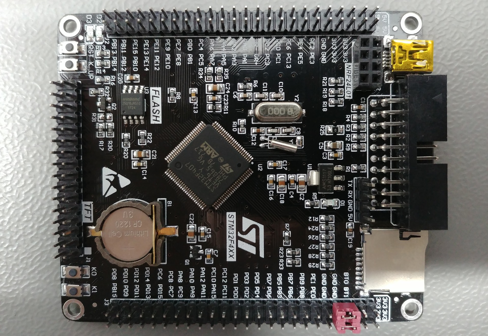
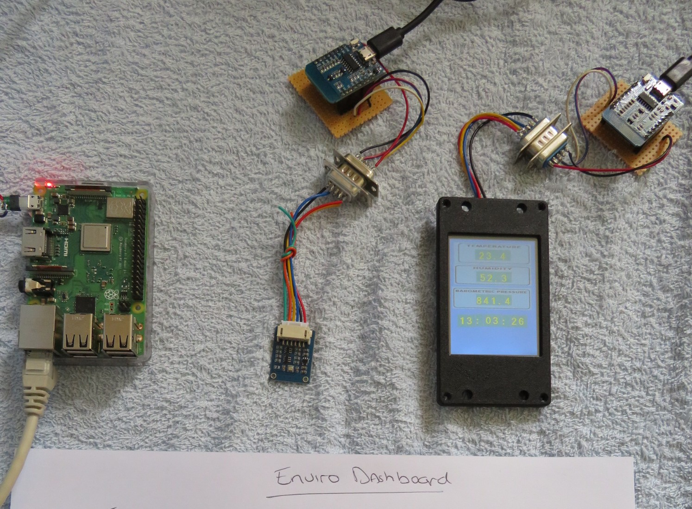

# 1.0 - Introducing STM32 Black

Meet your *microcontroller*!

# 2.0 - Enviro Dashboard

Overal Setup of Enviromental Dashboard

For examples and inspiration check out the [Wizard of Things](https://wizard-of-things.com).

